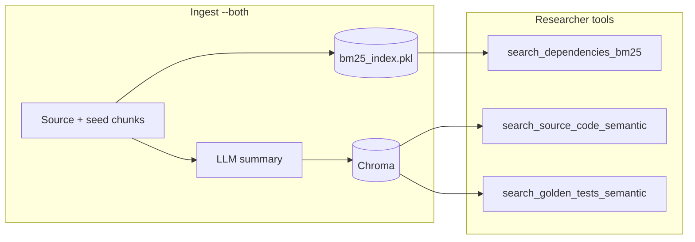

# ARTS

**Agentic Repo Test System** — LangGraph multi-agent pipeline that ingests a target repository, scores code risk with an ML model, runs retrieval-augmented research, and generates pytest files **inside your repo** under test.

**License:** [MIT](LICENSE) · **Status:** early open source — active development; [contributions welcome](CONTRIBUTING.md).

> **Before you run:** Read **[Limitations](#limitations)** (risk gate, Python-only scope, BYOR seeds, demo validation). Install **your target repo’s dependencies** in the same Python environment as ARTS so pytest can import them — see [docs/TARGET_REPO.md](docs/TARGET_REPO.md). Full pipeline and hybrid retrieval: [docs/ARCHITECTURE.md](docs/ARCHITECTURE.md).

## Demo

- **Quick overview (~5 min):** [LinkedIn walkthrough](https://www.linkedin.com/feed/update/urn:li:activity:7470499709799821313/)
- **Full system walkthrough (~30 min):** [YouTube](https://www.youtube.com/watch?v=hKFgm7mVf7I)

[](https://www.youtube.com/watch?v=hKFgm7mVf7I)

This is a **research / course-style** project, not a hosted SaaS. Expect local CLI, Rich streaming output, and Chroma + SQLite on disk.

**Demo scope:** The LinkedIn/YouTube walkthroughs use the default agent task  
`Write unit tests for the file analysis_service/analysis.py`  
(that path lives in **your** `REPO_PATH`, not in ARTS). Those runs were **smoke / happy-path** only — **complex scenarios were not systematically tested** (large repos, deep integration, exhaustive edge cases). Review generated tests before you rely on them.

## Why ARTS? (and when to use something else)

**Modern IDE agents** (Cursor, Claude Code, Codex SDK, etc.) with **spawn/hooks** and **code coverage in CI** are often enough for day-to-day test generation and review. ARTS is **not** claiming to replace that workflow.

**ARTS is a reference / self-hosted pipeline** for teams or learners who want:

- **Bring-your-own-repo** ingestion with **hybrid retrieval** (Chroma + BM25) over *your* codebase and golden seeds
- A **fixed LangGraph workflow** (research → plan → write → pytest → bounded repair) that is **auditable** via checkpoints and explicit routing
- **LLM-agnostic** runs (swap `MODEL_PROVIDER`) and optional **on-prem** models — no dependency on a single vendor IDE
- An **ML risk gate** before expensive agent steps on large trees (see [Risk gate](#risk-gate))

**Not a fit** if you only need ad-hoc tests in the editor, or if you need **security scanning / dynamic attack** tooling — that is [roadmap interest only](docs/ROADMAP.md), not shipped today.

Future directions (community / ideas): [docs/ROADMAP.md](docs/ROADMAP.md).

## Bring your own repo (no bundled dataset)

This project **does not ship a target codebase, golden test seeds, or pre-built vector index**. Each user points **`REPO_PATH`** at **their own** repository (any Python project you want tests for), adds **golden pytest examples** under `seed_data/` (see below), runs **ingestion locally**, then runs the agent. Generated tests and pytest run **inside that repo**; Chroma data lives under `./data/vector_store` on your machine (gitignored).

**Ingest is required** before meaningful researcher retrieval — see step 3 below. `main.py` and `run_local.py` warn if the vector store is empty when you start an agent-only run.

For a one-page cheat sheet, see [docs/QUICKSTART.md](docs/QUICKSTART.md).

## Hybrid retrieval (at a glance)

ARTS does **not** fuse BM25 and vectors into a single ranked list. **Ingest** builds two indexes; the **researcher agent** chooses tools (LLM-driven hybrid RAG):

| Tool | Index | Use for |
|------|--------|---------|
| `search_dependencies_bm25` | `data/bm25_index.pkl` (raw source text) | Exact dependency / `def` / `class` implementations |
| `search_source_code_semantic` | Chroma (LLM summaries on source) | Conceptual “what does this logic do?” in production code |
| `search_golden_tests_semantic` | Chroma (seed / test chunks, `is_test=True`) | How **your** repo mocks, fixtures, and patterns |



Semantic hits return **description + `metadata.source_code`** (`VectorDBService.search_code`). Details, LangGraph flow, and production notes: **[docs/ARCHITECTURE.md](docs/ARCHITECTURE.md)**.

## Quickstart

### 1. Clone and install

```bash
git clone https://github.com/jubranodesign/ARTS.git
cd ARTS
python -m venv .venv
# Windows: .venv\Scripts\activate
# Linux/macOS: source .venv/bin/activate
pip install -e .
# or: pip install -r requirements.txt
```

### 2. Configure environment

```bash
cp .env.example .env
```

Edit `.env`:

- Copy from [`.env.example`](.env.example) any keys you are missing (merge; do not wipe existing secrets).
- Set **`REPO_PATH`** to the repository you want to test (required).
- Install **target repo libraries** in this environment (e.g. `pip install -r "%REPO_PATH%/requirements.txt"`) — see [docs/TARGET_REPO.md](docs/TARGET_REPO.md).
- Set **`MODEL_PROVIDER`** (default `mistral`) and the matching API key (e.g. `MISTRAL_API_KEY`).
- **`REPO_LANGUAGE`** defaults to **`python`**. Ingest **text splitting** accepts any id mapped to langchain **`Language`** (e.g. `js`, `ts`, `java` — see `SPLITTER_LANGUAGE_IDS` in `shared/repo_language.py`). The **rest of ARTS** (scanner, pytest, prompts) remains **python-only**; see [Limitations](#python-only-target-repos-today).
- Optionally set **`USER_TASK`** or pass `--task` (default matches the [demo task](#demo); see [Agent task](#agent-task-user_task)).

#### Golden seed data (your examples)

ARTS does **not** include reference tests for your target repo. Before **`ingest --both`**, add pytest files under **`seed_data/`** inside **`REPO_PATH`** (or set **`REPO_SEED_PATH`**).

Golden seeds show the researcher **how your project writes tests**: imports, mocks, fixtures, naming, and patterns (HTTP, DB context managers, `caplog`, etc.). They are indexed separately from production source and retrieved via **`search_golden_tests_semantic`**.

- Keep seeds **representative** of the style you want generated.
- Cover the **kinds of complexity** you care about in target modules.
- Re-run **`python ingest.py --repo-path "%REPO_PATH%" --both`** after changing seed files.

Example layout in the repo under test:

```text
REPO_PATH/
  seed_data/
    test_example_patterns.py   # you provide — not shipped with ARTS
  analysis_service/
    analysis.py                  # example target from the demo task
```

Default seed path: `<REPO_PATH>/seed_data` (`shared/paths.get_repo_seed_path`). Override with **`REPO_SEED_PATH`** in `.env`.

### 3. Ingest vector store (**required** — first time or after repo changes)

Index **your** repo into the local vector store (not included in git):

```bash
python ingest.py --repo-path "%REPO_PATH%" --both
```

**`--both`** ingests **seed/golden tests first**, then full **source** (Chroma + BM25 on source).

Or use `run_local.py` with `RUN = "both"` and `INGEST_MODE = "both"` (ingest + agent in one go).

Skip this only if you already ingested the same `REPO_PATH` and still have `./data/vector_store` populated.

How summaries, raw code, and BM25 relate: [Ingestion & retrieval storage](#ingestion--retrieval-storage).

### 4. Run the agent

**CLI:**

```bash
python main.py --repo-path "%REPO_PATH%"
# default demo task (override with --task):
# --task "Write unit tests for the file analysis_service/analysis.py"
```

**Local dev (edit flags in file):**

```bash
python run_local.py
```

Set `LOG_LEVEL=DEBUG` in `.env` for detailed logs from `wait_for_task`, writer, and failure analysis.

### 5. What you should see

- Rich panels per graph node (researcher, designer, writer, executor).
- If the run **stops early** with little output, see [Risk gate](#risk-gate) below.

## Ingestion & retrieval storage

Ingestion uses a **dual-index** design: the same source chunks are stored differently for semantic vs keyword retrieval.

### Chroma (`data/vector_store/`)

- Source and seed files are split into chunks, then **enriched with an LLM summary** using **language-agnostic ingest prompts** (`shared/ingestion_prompts.py`, wired via `shared/repo_language.py`).
- Chunk splitting uses **`REPO_LANGUAGE`** → langchain **`Language`** via `shared/repo_language.py` (scanner still indexes **`.py`** only).
- **Embeddings** are computed on **`page_content`** (the summary), not on raw syntax.
- The **original chunk** is kept in **`metadata["source_code"]`** and is returned with semantic search (`VectorDBService.search_code`).

### BM25 (`data/bm25_index.pkl`)

- Built only when ingesting **production source** (not seed-only runs).
- Indexes **raw source text** from each chunk (`utils/retrieval.prepare_bm25_documents`), excluding test/seed files. BM25 tokenization follows **`REPO_LANGUAGE`** via `get_bm25_preprocess_func()` in `shared/repo_language.py`: **Python** splitter id → `python_code_tokenizer`; other known languages → `generic_code_tokenizer`.
- Loaded by the researcher tool **`search_dependencies_bm25`** for dependency / symbol lookup.

### Researcher vs offline eval

| Consumer | Semantic (Chroma) | Keyword (BM25 / raw code) |
|----------|-------------------|---------------------------|
| Live agent (`agents/researcher_agent/tools.py`) | Yes | Yes (BM25) |
| `python evaluation.py retrieval` | Yes | **No** — metrics match keywords against **`page_content` only** |

After changing `REPO_PATH` or target code, re-run `python ingest.py --repo-path ... --both` so Chroma and BM25 stay in sync.

### Agent task (`USER_TASK`)

Resolution order: CLI **`--task`** → **`USER_TASK`** in `.env` → `DEFAULT_USER_TASK` in `shared/constants.py`.

**Default (used in demos):**

```text
Write unit tests for the file analysis_service/analysis.py
```

Examples:

```bash
python main.py --repo-path "%REPO_PATH%" --task "Write unit tests for the file analysis_service/analysis.py"
```

```env
USER_TASK=Write unit tests for the file analysis_service/analysis.py
```

Use paths **relative to `REPO_PATH`**. Offline eval datasets under `evaluation/` may mention other modules (e.g. for BYOR tuning) — that is **separate** from the demo task above.

## Configuration reference

| Variable | Default | Purpose |
|----------|---------|---------|
| `REPO_PATH` | — | Target repo (required) |
| `REPO_LANGUAGE` | `python` | Ingest splitter: langchain `Language` ids; **full pipeline** still **python** only |
| `REPO_SEED_PATH` | `<REPO_PATH>/seed_data` | Golden pytest examples for ingest seed pass |
| `MODEL_PROVIDER` | `mistral` | LLM backend for all agent nodes |
| `RISK_THRESHOLD` | `0.2` | Min ML risk score to enter researcher path |
| `MAX_TEST_ATTEMPTS` | `3` | Pytest failure → writer repair loops |
| `LOG_LEVEL` | `INFO` | Python logging (`DEBUG` for dev) |
| `USER_TASK` | `Write unit tests for the file analysis_service/analysis.py` | Demo default; override for your file |

### LangGraph `configurable` (per run)

Built by `shared/graph_config.build_langgraph_run_config`. **Not** the same as `.env` policy vars.

| Key | Required | Set via | Used by |
|-----|----------|---------|---------|
| `thread_id` | yes | default / `GRAPH_CONFIG` | SQLite checkpointer |
| `model_provider` | yes | `MODEL_PROVIDER` env / `GRAPH_CONFIG` | all LLM nodes (`setup_node_llm`) |
| `repo_path` | yes | `run_*` args (`REPO_PATH`) | wait_for_task, tools, writer, executor |
| `vdb` | yes | `run_*` args | researcher tools, save_test |
| `processor` | yes | `run_*` args | save_test |

**`GRAPH_CONFIG` / `configurable=`** may only override: `thread_id`, `model_provider`. Unknown keys raise `ValueError`.

**Env-only policy** (not in `configurable`): `RISK_THRESHOLD`, `MAX_TEST_ATTEMPTS` — see `shared/run_policy.py`.

Example: `GRAPH_CONFIG = {"model_provider": "groq", "thread_id": "dev-1"}` in `run_local.py`.

Single source for merge/validation: `shared/graph_config.py`. Defaults for provider/thread: `shared/run_policy.py` + `DEFAULT_THREAD_ID` in graph_config.

**Vector DB:** `run_test_system_stream`, `run_agent_only`, `run_ingest_only`, and `run_pipeline` require a **`VectorDBService` instance** (no hidden `VectorDBService()` inside). Entry points create it once — e.g. `main.py` CLI and `run_local.py` call `create_vector_db()` from `main`, and `ingest.py` CLI constructs `VectorDBService()` before ingestion. Pass the same instance through `run_pipeline` for ingest + agent.

## Risk gate

After `wait_for_task`, a random-forest risk score is computed on the target file.

- If **`risk_score >= RISK_THRESHOLD`** (default **0.2**): flow continues to **researcher** → designer → writer → executor.
- If **`risk_score < RISK_THRESHOLD`**: the graph routes to **END**. You will **not** get tests or writer output — only the early risk step runs (plus stream setup). This is intentional (high-recall gate from the ML notebook), not a crash.

To proceed on “low risk” files during experiments, temporarily lower `RISK_THRESHOLD` in `.env` (e.g. `0.0`) or point `USER_TASK` at a file the model scores higher.

## Limitations

Read these before running on an important repository.

### Demo validation scope

Documented demos and the default **`USER_TASK`** above were **not** stress-tested on complicated cases (multi-service repos, async/concurrency, full error matrices, security-sensitive code). Treat output as a **starting point** for human review.

### Python-only target repos (today)

ARTS is built around **Python** target repositories: `.py` scanning, **pytest** execution, Radon + ML **risk gate**, and agent prompts assume pytest/unittest.mock patterns. **`REPO_LANGUAGE`** can select a **chunk splitter** (`Language` enum, e.g. `ts`, `java`) for ingest, but without `.py` scanning and pytest for other languages the **end-to-end workflow** remains **python-only** (`ARTS_FULLY_SUPPORTED_LANGUAGES` in `shared/repo_language.py`).

### Graph interrupt (`wait_for_task`)

The compiled graph uses `interrupt_before=["wait_for_task"]` for LangGraph Studio / human-in-the-loop workflows. The CLI and `run_local` path **seed state** with `update_state` and then **`stream`**, which resumes past the interrupt. If you invoke the graph differently (e.g. raw LangGraph CLI without that pattern), `wait_for_task` may not run until you resume correctly.

### Ingestion required

Semantic/BM25 tools expect a populated Chroma store under `data/vector_store` and (for source ingest) `data/bm25_index.pkl`. Run **`ingest.py --both`** (or `RUN=both` in `run_local.py`) before expecting useful researcher retrieval. See [Ingestion & retrieval storage](#ingestion--retrieval-storage).

### ML model at import

`wait_for_task` imports `ml_predictor` and loads the sklearn model when that node module loads. First run can be slower; the model file must be present in the project layout expected by `ml_predictor.utils`.

### Writes and pytest under `REPO_PATH`

The writer uses tools to **read and write files under `REPO_PATH`**, typically under `tests/…`. The executor runs **`pytest`** on those paths with `cwd=REPO_PATH` using the **same Python interpreter as ARTS** — your repo’s packages must be installed there ([docs/TARGET_REPO.md](docs/TARGET_REPO.md)). Use a disposable clone or branch — not production code without review.

### Checkpoint SQLite

Runs persist LangGraph state to `checkpoints.sqlite` (or `CHECKPOINT_DB`). Re-use the same `thread_id` to continue threads; delete the file for a clean slate. Checkpoints support **audit and resume** — they do **not** automatically revert failed test-repair attempts to an earlier graph state (see [docs/ARCHITECTURE.md](docs/ARCHITECTURE.md) § Test repair loop).

## Project layout (short)

| Path | Role |
|------|------|
| `docs/QUICKSTART.md` | Condensed setup |
| `docs/ARCHITECTURE.md` | LangGraph flow, hybrid retrieval, multi-vector ingest |
| `docs/TARGET_REPO.md` | BYOR dependencies, seeds, local vs isolated runtime |
| `docs/ROADMAP.md` | Future ideas (not implemented): security plugin, sandbox executor, eval |
| `main.py` | CLI + streaming UX |
| `run_local.py` | Dev entry (`RUN=ingest\|agent\|both`) |
| `ingest.py` | Chroma + BM25 ingestion |
| `graph/builder.py` | LangGraph definition |
| `graph/routes.py` | Risk gate, repair loop |
| `agents/` | Researcher, designer, writer, executor nodes |
| `evaluation/` | Offline RAG/metrics (not imported by the live graph) |

## Development notes

- Entry points call `configure_logging()` after `load_dotenv()`. `build_app()` does **not** change log level, so `LOG_LEVEL=DEBUG` stays active for the whole run.
- Do not commit `.env` or `data/vector_store/` (see `.gitignore`).

For deeper evaluation workflows, see below. **Ground truth** for Ragas lives in evaluation datasets, not in `main.py` or `GRAPH_CONFIG`.

## Offline evaluation

Evaluations are **separate from the agent graph**. They help you check retrieval quality and a bundled researcher RAG sample after you **ingest your own repo**.

1. Set `REPO_PATH` and run ingest (datasets in `evaluation/retrieval/datasets.py` target scraper-style queries — edit them for your codebase).

**Retrieval eval vs live retrieval:** `python evaluation.py retrieval` only queries **Chroma** (semantic search on LLM **summaries** in `page_content`). It does **not** use the BM25 index or match against raw code in `metadata["source_code"]`. The bundled dataset uses literal code-style keywords — for your repo, prefer phrases that appear in summaries, or extend `evaluation/retrieval/metrics.py` to check `source_code` as well. See [Ingestion & retrieval storage](#ingestion--retrieval-storage).

2. **Retrieval** (Chroma-only metrics):

```bash
python evaluation.py retrieval
```

3. **RAG / Ragas** (optional extra; uses static sample in `evaluation/rag/researcher_agent/datasets.py`):

```bash
pip install -e ".[eval]"
python evaluation.py rag
# or: python -m evaluation rag
```

**Without CLI** — edit `run_eval_local.py` (`RUN = "retrieval"` | `"rag"`) or import:

```python
from evaluation import run_retrieval_eval, run_rag_eval
run_retrieval_eval(vdb)  # pass shared VectorDBService after ingest
run_rag_eval()
```

Requires LLM + embedding API keys (same as the agent). For a different project, update the dataset files under `evaluation/retrieval/` and `evaluation/rag/`.
