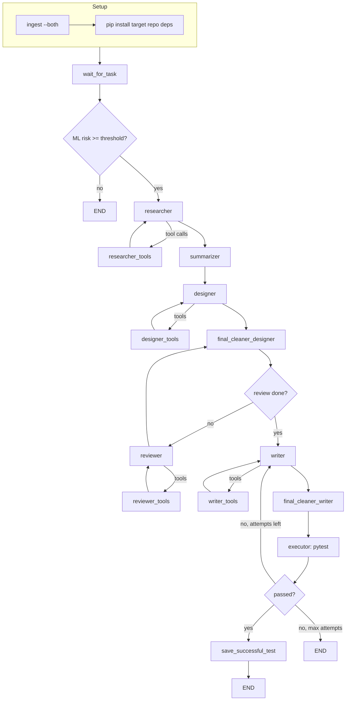
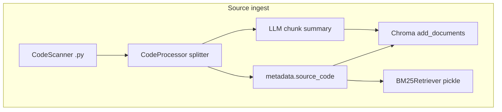

# ARTS architecture

High-level design for the **Agentic Repo Test System**. For setup, see [README](../README.md) and [QUICKSTART](QUICKSTART.md). For target-repo dependencies, see [TARGET_REPO](TARGET_REPO.md).

## End-to-end pipeline

ARTS runs on your machine against **`REPO_PATH`** (bring your own repo). Typical flow:

1. **Ingest** (`ingest.py --both`) — index golden seeds + source into Chroma; build BM25 on source.
2. **Configure** — `.env`: `REPO_PATH`, API keys, optional `USER_TASK`; install **target repo** Python packages.
3. **Agent** (`main.py` / `run_local.py`) — LangGraph stream: risk gate → research → design → write → pytest → optional repair loop.

Graph definition: `graph/builder.py`. Routing (risk gate, repair loop): `graph/routes.py`.

### Risk gate

After `wait_for_task`, a random-forest model scores the **target file** (Python metrics via Radon). If **`risk_score < RISK_THRESHOLD`** (default `0.2`), the graph ends — no researcher, writer, or tests. Lower the threshold for experiments (`RISK_THRESHOLD=0.0` in `.env`).

### Test repair loop (self-healing)

On pytest failure:

1. **`executor`** captures stdout/stderr and increments **`attempts`**.
2. If **`attempts < MAX_TEST_ATTEMPTS`**, the graph routes to **`writer`** with logs; **`failure_analyzer`** picks a repair prompt.
3. The writer may **`write_local_file`** (full file) or **`patch_test_code`** (SEARCH/REPLACE blocks via `utils/patch.py`) — repair prompts favor **surgical patches**.
4. If max attempts is reached, the graph **stops** (no further writer loop).

**Checkpoints** (`checkpoints.sqlite`) record graph state for **resume and inspection** (`get_state_history` in `main.py`). There is **no automatic rollback** to a prior checkpoint or git state when repairs fail; use version control on `REPO_PATH` for file-level recovery.

---

## Hybrid retrieval

“Hybrid” here means **two indexes at ingest** plus **three researcher tools** at runtime — not a single fused retrieval score.

### Ingest: dual index (multi-vector)

| Store | Built from | Used for |
|-------|------------|----------|
| **Chroma** (`data/vector_store/`) | LLM **summaries** embedded in `page_content`; raw chunk in `metadata.source_code` | Semantic search (source + seeds) |
| **BM25** (`data/bm25_index.pkl`) | **Raw** source code chunks (non-test files) | Keyword / symbol-style dependency lookup |

Seed ingest (`--both` first pass) uses test-oriented summaries; source ingest adds production code. See README § [Ingestion & retrieval storage](../README.md#ingestion--retrieval-storage).

Implementation: `services/code_processor.py`, `ingest.py`, `utils/retrieval.prepare_bm25_documents`.

### Runtime: researcher tools

The researcher LLM follows `agents/researcher_agent/prompts.py`:

1. **`search_dependencies_bm25`** — Load BM25 index; query with `def` / `class` style strings; skip chunks from the current target file; return **raw code** from the match.
2. **`search_source_code_semantic`** — Chroma search with `is_test=False`; returns description + source snippets.
3. **`search_golden_tests_semantic`** — Chroma search with `is_test=True`; golden / seed patterns for the writer and designer.

The agent loops **researcher ↔ researcher_tools** until it finishes tool discovery, then **summarizer** compresses architecture + golden patterns into state for downstream nodes.

### Offline eval vs live agent

| | Live researcher | `evaluation.py retrieval` |
|--|-----------------|---------------------------|
| Chroma semantic | Yes | Yes |
| BM25 | Yes | **No** |
| Keyword check | N/A | On `page_content` (summaries) only |

---

## Agents (downstream of research)

| Node | Role |
|------|------|
| **designer** | Test plan from research dump + golden examples |
| **reviewer** | Critique plan; loop until review completes |
| **writer** | Generate / patch pytest under `REPO_PATH` |
| **executor** | `run_tests` → pytest with `PYTHONPATH` including repo + service dir |
| **save_successful_test** | Persist passing test into vector index (optional enrichment) |

Prompts assume **pytest** and Python syntax today (`REPO_LANGUAGE=python` only).

---

## Configuration surfaces

| Layer | Examples |
|-------|----------|
| `.env` | `REPO_PATH`, `RISK_THRESHOLD`, `MAX_TEST_ATTEMPTS`, `REPO_LANGUAGE`, `USER_TASK` |
| LangGraph `configurable` | `repo_path`, `vdb`, `processor`, `model_provider`, `thread_id` |
| Injected at entry | `VectorDBService`, `CodeProcessor` from `main.py` / `run_local.py` |

---

## Production direction (not implemented)

Today ARTS shares **one Python environment** with the target repo’s installed packages. A production-style deployment would separate:

- **Agent base image** — ARTS + LLM clients + ingest tooling.
- **Per-run sandbox** — clone `REPO_PATH`, `pip install` that repo’s dependencies in an **isolated venv or container**, run pytest with that interpreter, discard or quarantine the environment after the job.

Document this expectation for operators; local OSS users install both ARTS and target deps manually ([TARGET_REPO](TARGET_REPO.md)).

Community ideas (security plugin, sandbox executor, etc.): [ROADMAP.md](ROADMAP.md).
